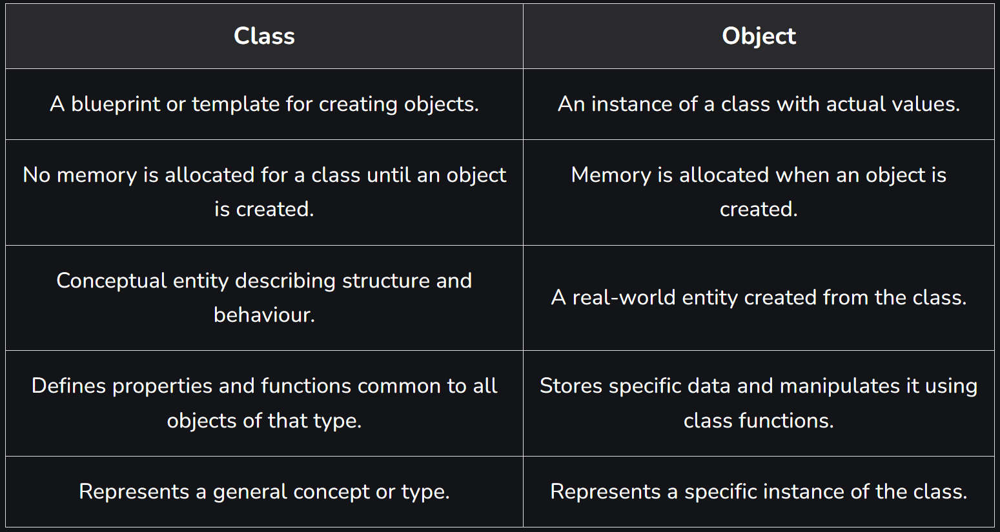

# What is a Class?
A class is a user-defined data type, which holds its own data members and member functions that can be accessed and used by creating an instance of that class. A C++ class is like a blueprint for an object.

# For Example: 
Consider the Class of Cars. There may be many cars with different names and brands but all of them will share some common properties like all of them will have 4 wheels, Speed Limit, Mileage range, etc. The car can also accelerate, turn, apply brakes, etc. So here, the Car is the class, wheels, speed limits, and mileage are its attributes (data members) and accelerate, turn, apply brakes are its methods (member functions).

# Access Modifiers
In C++ classes, we can control the access to the members of the class using Access Specifiers. Also known as access modifier, they are the keywords that are specified in the class and all the members of the class under that access specifier will have particular access level.

In C++, there are 3 access specifiers that are as follows:

Public: Members declared as public can be accessed from outside the class.
Private: Members declared as private can only be accessed within the class itself.
Protected: Members declared as protected can be accessed within the class and by derived classes.

# What is an Object?
When a class is defined, only the specification (attributes and behaviour) for the object is defined. No memory is allocated to the class definition. To use the data and access functions defined in the class, we need to create its objects.

Objects are the actual entities that are created as an instance of a class. There can be as many objects of a class as desired.

# Constructor
Constructors are special class members which are called by the compiler every time an object of that class is instantiated. They are used to construct the objects and making them ready for use. Constructors have the same name as the class.